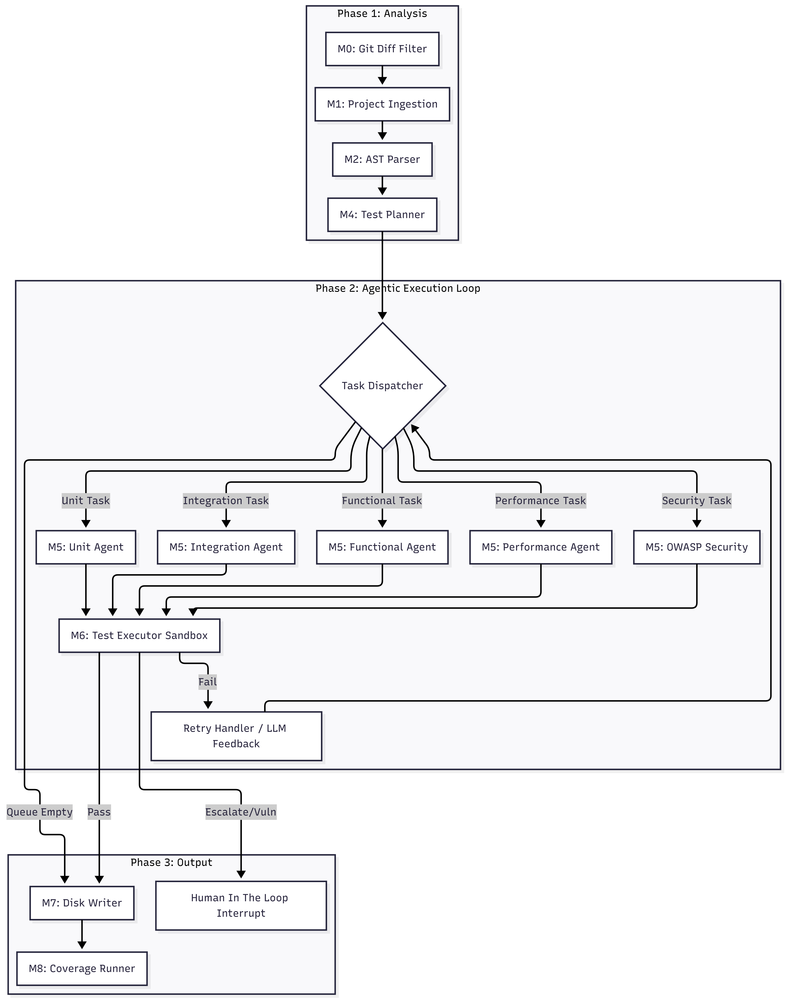

# ATLAS Workflow & Architecture Guide

Use this document to guide the reviewers through the technical architecture of your project. 

## 1. High-Level Concept
**ATLAS v1.0** is an automated, LangGraph-driven multi-agent system designed to completely automate the software testing lifecycle. It ingests source code, plans test scenarios, generates tests via LLMs (OpenAI, Anthropic, Gemini, Groq), executes them in a sandbox, self-corrects failures, and guarantees test coverage.

## 2. Architecture Diagram

## 3. Step-by-Step Explanation for Reviewers

When presenting, walk through the nodes (M0 through M8) to show how data flows through the application:

### Step 1: Pre-Processing (M0 - M2)
- **M0 Git Diff**: We don't want to re-test the entire massive codebase every time. M0 analyzes the `git diff` to figure out exactly which files were modified.
- **M1 Ingestion**: Reads the target files, identifies the programming language, and loads the surrounding module context.
- **M2 AST Parser**: Uses Tree-sitter to break the code down into an Abstract Syntax Tree. It identifies all functions, classes, and their cyclomatic complexity so the LLM understands the structure of the code perfectly.

### Step 2: Planning (M4)
- **M4 Test Planner**: Acts as the brain. It takes the AST data and decides what needs testing. It generates a "Task Queue" (e.g., *Task 1: Unit Test for function A, Task 2: Security Test for function B*).

### Step 3: The Parallel Agents (M5)
- The Task Dispatcher pops a task and sends it to the appropriate specialized **M5 Layer Agent**.
- Each agent uses a different system prompt. For example, the **Security Agent (m5_owasp)** is specifically prompted to look for OWASP Top 10 vulnerabilities (SQLi, XSS, Broken Auth) and write attacks against the code.

### Step 4: Execution & Self-Correction (M6)
- **M6 Test Executor**: Takes the raw LLM output and executes it in an isolated Pytest sandbox. 
- **The Self-Correction Loop**: If the test fails (e.g., due to an `ImportError` or a bad mock), M6 parses the `stderr` traceback and sends it back to the agent in M5, saying *"Your test failed with this error, fix it."* This loop runs up to 3 times automatically.

### Step 5: Escaping the Loop (HITL & M7/M8)
- **Human-In-The-Loop**: If the Security agent successfully breaches the code, it flags the verdict as `ESCALATE`. The graph pauses and alerts the developer in the terminal to fix the vulnerability.
- **M7 Disk Writer**: Once tests pass, they are officially written to the `tests/` directory.
- **M8 Coverage**: Finally, the system runs a full coverage report to prove to the developer that the generated tests actually cover the code.

---

> [!TIP]
> **What to emphasize to the reviewers:** 
> Highlight that this isn't just an "LLM text generator." Emphasize the **M2 AST Parsing** (showing you understand static code analysis) and the **M6 Self-Correction loop** (showing you understand autonomous agent engineering and sandboxing).
